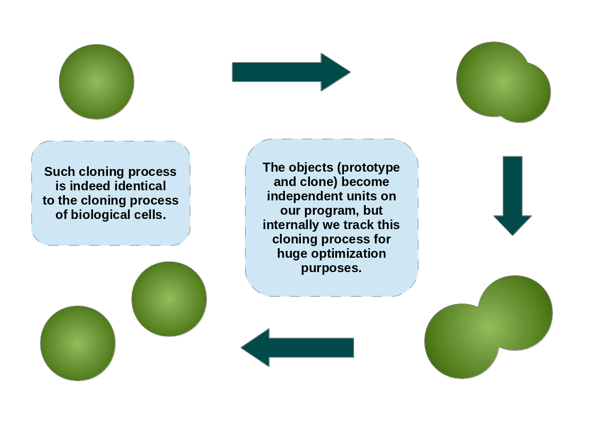
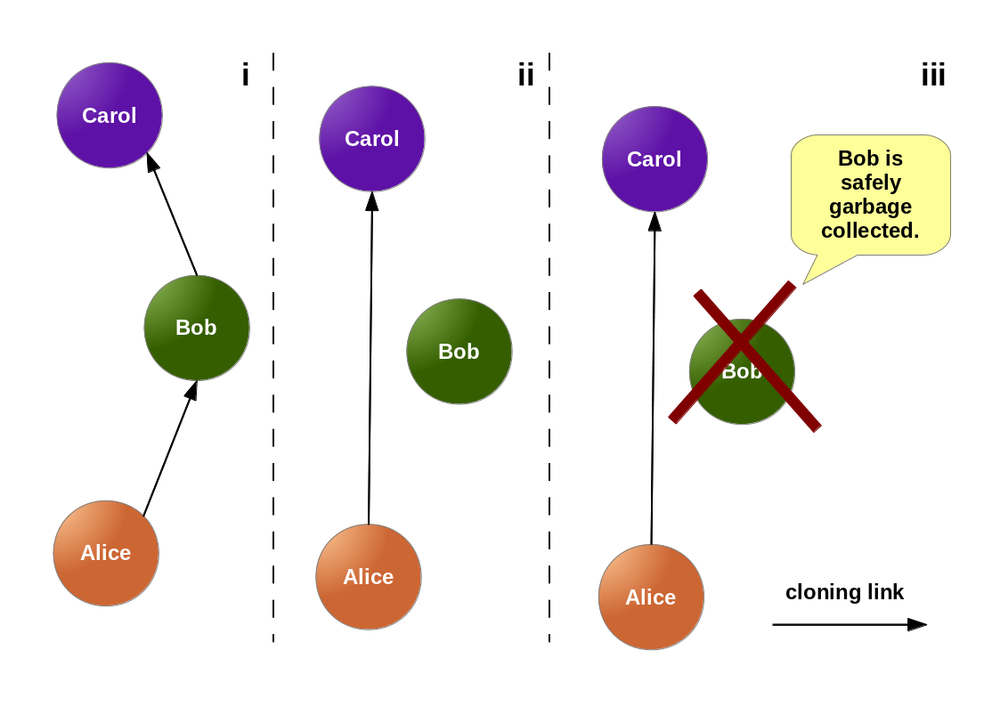

# families

Concatenation-based prototypes implementation for Lua.

[](https://travis-ci.org/marcoonroad/families)
[](https://coveralls.io/github/marcoonroad/families?branch=master)

### Introduction

This is a simple but somehow pure OO framework for the Lua language. Pure in the
sense cause it discards delegation entirely, but still preserving object inheritance
feel of Self/JavaScript. Such kind of delegation-less prototypes are known as
concatenative prototypes. They're implemented on the Kevo language together with some
features called _module operations_, which are in some sense akin to the well-known trait
operators.



Because I already have implemented a library for software composition
[here](http://github.com/marcoonroad/talents), I'm reserving myself to implement just
concatenation into this library. Besides, I
am free here to focus on concatenative object inheritance and also free to optimize that
fast as hell. The current state of this library is simple yet, however. Despite the removal
of delegation, it's planned to provide it in fine-grained & specific ways through a concept
known as [First-Class Delegation Links](http://marcoonroad.github.io/First-Class-Delegation-Links).

### Usage

The API was designed to be simple and minimal. To create an object in this library, we'll
use the function `clone` existing in the `families` module:

```lua
local families = require "families"

-- yadda yadda yadda --

local object = families.clone (prototype, structure)
```

Where `prototype` is a previously created object and `structure` is where `object` differs
from its prototype. The `prototype` can be `nil`, and an alias is provided as well for such
cases:

```lua
local prototype = families.prototype (structure)
```

So, the equivalent relations are:

```
families.prototype (structure) <===> families.clone (nil, structure)
```

Where `structure` is the table which contains the whole definition for `prototype`. On the
other side, there's also simple functions for introspection into result cloning hierarchy.
They're `resembles` and `represents`, where the following holds:

```lua
local prototype = families.prototype { ... }
local clone     = families.clone (prototype, { ... })

assert (families.resembles  (clone,     prototype))
assert (families.represents (prototype, clone))
```

Note that resemblance and representation are transitive relations, that is, for all A, B, C
being objects from this library, if resembles(C, B) and resembles(B, A), therefore,
resembles(C, A) holds as well.

### Optimizations

This section is reserved to discuss planned and implemented optimizations, trade-offs,
benchmarks and metrics. By now, it implements a minor variation of the classical clone
families algorithm, which triggers propagation of the creation-time state into the cloned
objects. Later, refinements are possible, and whenever I can, I'll discuss the used trade-off
memory versus speed.

+ v0.1-1: This version implements a variant of the clone families algorithm. It also optimizes
  for the cases where garbage collection of parents/prototypes occur. In that cases, it propagates
  the changes for the current state of the prototype being collected. If the clones are outdated
  for some selector, they'll receive that current state from the prototype. Later, the current prototype's
  prototype become the prototype of the current prototype's clones in the following way:




This optimization avoids a bunch of unnecessary things, for example, many iterations gathering the
state of parents following the chains/links of cloning. Due the seamless and transparent semantics of
clone families, we can replace that links provided they're consistent. That consistency is achieved
with the propagation of the state from the prototype, whenever some clone's selector is not changed
since the creation/cloning time, it's updated to reflect the same selector on the prototype going to
be collected. This entire algorithm is tracked by the `__gc` metamethod, and so, requires Lua >= 5.2
(although it's possible to implement for the version 5.1, we just need to workaround with the unofficial
`newproxy` function, but it can break some third-party semantics relying on such objects being tables
rather than userdata).

That garbage collection is implemented to also avoid Out of Memory errors. In the naive implementation
of prototypes, cloning is an operation which cannot be used often cause, for example, clones hold
strong references for their prototype counterparts. With this library, clones don't hold such kind
of strong references, and therefore, you can clone early and clone often. Let's clone things all the
way down as it were an human body/organism! Let's really reflect the biological Alan Kay's definition
of Object-Oriented Programming! Make objects great again!

A simple PIC (Polymorphic Inline Cache) algorithm is also implemented. It is used to trade memory for
speed, although on the booting the application can suffer a significant delay while mounting such cache.
The major difference from common PICs here is that our PICs aren't caches per se, but mostly a kind of
immutable database. I mean, there are no issues regarding how much time things are stored, neither if they
could not reflect the current state of the parent object. It's all due the elimination of delegation, so
things become nicer and we have more profit than losses with that. F*ck delegation and live better.
Concatenation (i.e, creation-time sharing) is really an improvement for OO, thank you Taivalsaari!

### References

+ [1] _Classes vs. Prototypes: Some Philosophical and Historical Observations_, by Antero Taivalsaari, __1996__
+ [2] _Simplifying JavaScript with Concatenation-based Prototype Inheritance_, by Antero Taivalsaari, __2009__

END
