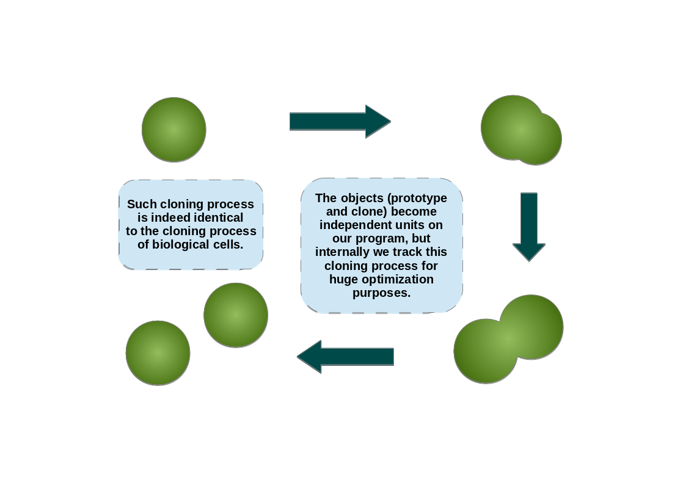

# families

Concatenation-based prototypes implementation for Lua.

[](https://travis-ci.org/marcoonroad/families)
[](https://coveralls.io/github/marcoonroad/families?branch=master)

### Introduction

This is a simple but somehow pure OO framework for the Lua language. Pure in the
sense cause it discards delegation entirely, but still preserving object inheritance
feel of Self/JavaScript. Such kind of delegation-less prototypes are known as
concatenative prototypes. They're implemented on the Kevo language together with some
features called _module operations_, which are in some sense akin to the well-known trait
operators.



Because I already have implemented a library for software composition
[here](http://github.com/marcoonroad/talents), I'm reserving myself to implement just
concatenation into this library. Besides, I
am free here to focus on concatenative object inheritance and also free to optimize that
fast as hell. The current state of this library is simple yet, however. Despite the removal
of delegation, it's planned to provide it in fine-grained & specific ways through a concept
known as [First-Class Delegation Links](http://marcoonroad.github.io/First-Class-Delegation-Links).

### Usage

The API was designed to be simple and minimal. To create an object in this library, we'll
use the function `clone` existing in the `families` module:

```lua
local families = require "families"

-- yadda yadda yadda --

local object = families.clone (prototype, structure)
```

Where `prototype` is a previously created object and `structure` is where `object` differs
from its prototype. The `prototype` can be `nil`, and an alias is provided as well for such
cases:

```lua
local prototype = families.prototype (structure)
```

So, the equivalent relations are:

```
families.prototype (structure) <===> families.clone (nil, structure)
```

Where `structure` is the table which contains the whole definition for `prototype`. On the
other side, there's also simple functions for introspection into result cloning hierarchy.
They're `resembles` and `represents`, where the following holds:

```lua
local prototype = families.prototype { ... }
local clone     = families.clone (prototype, { ... })

assert (families.resembles  (clone,     prototype))
assert (families.represents (prototype, clone))
```

Note that resemblance and representation are transitive relations, that is, for all A, B, C
being objects from this library, if resembles(C, B) and resembles(B, A), therefore,
resembles(C, A) holds as well.

For more information, check out our [wiki](https://github.com/marcoonroad/families/wiki) made with love!

Happy hacking!

END
