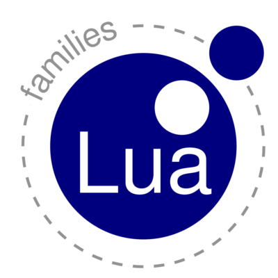
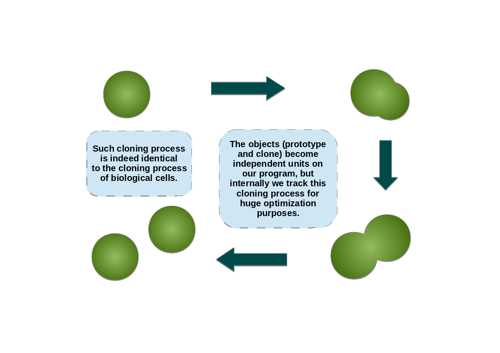

---
---

# families

Concatenation-based prototypes implementation for Lua.


<center>
   <p/> <p/>

  <a href="https://travis-ci.org/marcoonroad/families">
  
  </a>
<span> </span>
  <a href="https://coveralls.io/github/marcoonroad/families">
  
  </a>
<span> </span>
  
<span> </span>
  <a href="http://luarocks.org/modules/marcoonroad/families">
  
  </a>
</center>

### Topics/Sections

* Installation
* Introduction
* Usage
* Why???
* Further Information

### Installation

Through Luarocks:

```shell
$ luarocks --local install families
```

Through this project root directory:
```shell
$ luarocks --local make
```

### Introduction

This is a simple but somehow pure OO framework for the Lua language. Pure in the
sense cause it discards delegation entirely, but still preserving object inheritance
feel of Self/JavaScript. Such kind of delegation-less prototypes are known as
concatenative prototypes. They're implemented on the Kevo language together with some
features called _module operations_, which are in some sense akin to the well-known trait
operators.



Because I already have implemented a library for software composition
[here](http://github.com/marcoonroad/talents), I'm reserving myself to implement just
concatenation into this library. Besides, I
am free here to focus on concatenative object inheritance and also free to optimize that
fast as hell. The current state of this library is simple yet, however. Despite the removal
of delegation, it's planned to provide it in fine-grained & specific ways through a concept
known as [First-Class Delegation Links](http://marcoonroad.github.io/First-Class-Delegation-Links).

### Usage

The API was designed to be simple and minimal. To create an object in this library, we'll
use the function `clone` existing in the `families` module:

```lua
local families = require "families"

-- yadda yadda yadda --

local object = families.clone (prototype, structure)
```

Where `prototype` is a previously created object and `structure` is where `object` differs
from its prototype. The `prototype` can be `nil`, and an alias is provided as well for such
cases:

```lua
local prototype = families.prototype (structure)
```

So, the equivalent relations are:

```
families.prototype (structure) <===> families.clone (nil, structure)
```

Where `structure` is the table which contains the whole definition for `prototype`.

### Why???

I just want to _Clone early and Clone often_ without the burden of Delegation in the middle of
path. Said that, I just want also to leverage the promising prototype-based programming with the whole
benefits from concatenative prototypes carried together. This library aims to provide a scalable,
fast/efficient and easy to reason prototype-based OO framework. Yet, it will be kept as simple as possible.
In the end, it will be easy to learn, to prototype, to debug and to extend (without the fear of breaking things
as it occurs on either delegative or class-based world).

### Further Information

For more information, check out our [wiki](https://github.com/marcoonroad/families/wiki) made with love!

Happy hacking!
